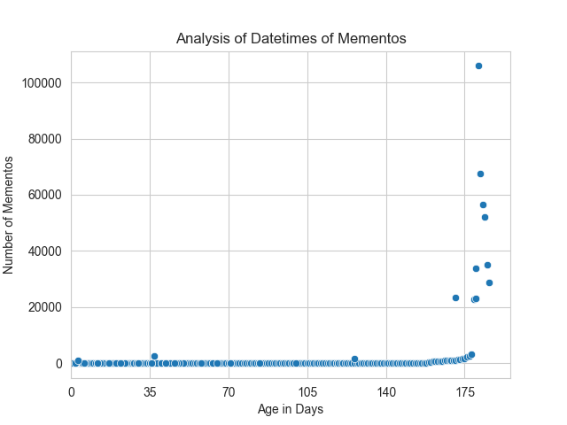

# Web Archiving - Memento Counter

This project was created for an assignment for the Old Dominion University course 
CS 432 - Web Science in the fall of 2021. This project collects tweets given that twarc2 is set up on a machine, and that the user
has a Twitter Developer account.

The final memento count from each unique URI-R is displayed via scatter plot that is created
through use of the Seaborn library.

